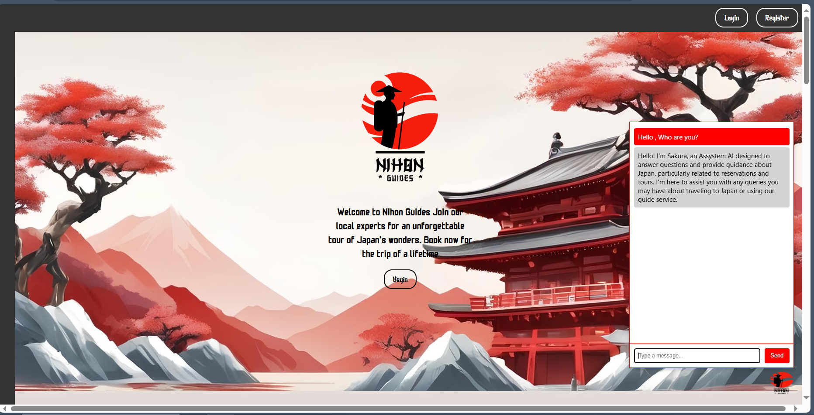
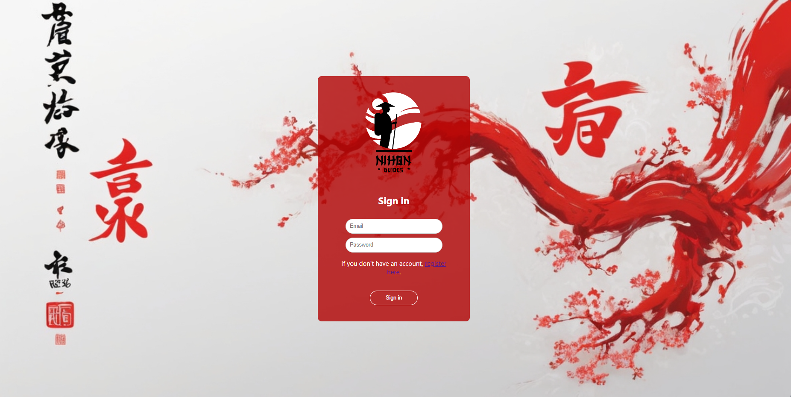
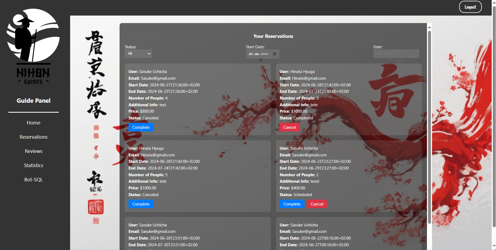
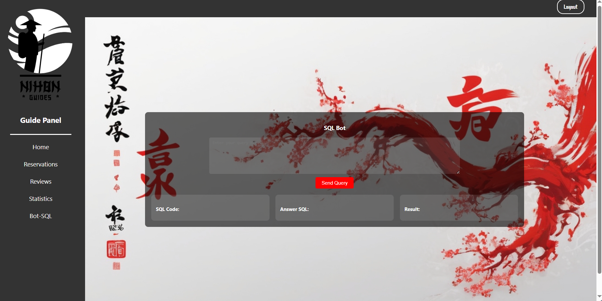

# Japan Travel Booking Application

## Overview
This project is a web application designed for travelers to Japan, offering functionalities such as account creation, 
reservation booking, reviews, and a chatbot that answers queries. Additionally, there is a specialized chatbot for tour guides that generates SQL queries based on a PostgreSQL database.

## Features
- **Account Creation:** Users can create and manage their personal accounts.
- **Reservation Booking:** Users can book travel arrangements and manage their reservations.
- **Reviews:** Users can write and read reviews about their travel experiences.
- **Traveler Chatbot:** An interactive chatbot that answers user questions about traveling in Japan.
- **Guide Chatbot:** A specialized chatbot for tour guides that generates SQL queries based on data from a PostgreSQL database.
- 
## Technologies Used
- **React:** A JavaScript library for building user interfaces.
- **Python:** A programming language that powers the backend logic.
- **Django:** A modern, fast (high-performance) web framework for building APIs with Python.
- **Langchain:** A framework to manage and customize the interactions with language models.
- **HuggingFace:** A platform providing state-of-the-art natural language processing models.
- **PostgreSQL:** A powerful, open-source object-relational database system.
  
### Image

